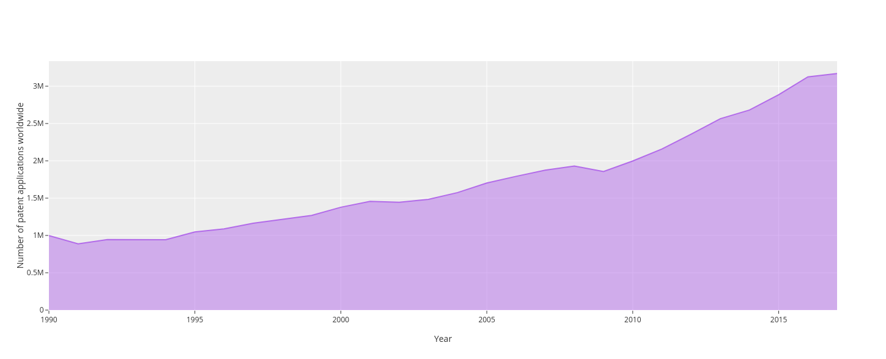

<!--
This is for including Chapter 1.  Notice that it's also good practice to name your chunk.  This will help you debug potential issues as you knit.  The chunk above is called intro and the one below is called chapter1.  Feel free to change the name of the Rmd file as you wish, but don't forget to change it here from chap1.Rmd.
-->

<!--
The {#rmd-basics} text after the chapter declaration will allow us to link throughout the document back to the beginning of Chapter 1.  These labels will automatically be generated (if not specified) by changing the spaces to hyphens and capital letters to lowercase.  Look for the reference to this label at the beginning of Chapter 2.
-->

# Literature review
## TMS, FMS and RDA system

The following three groups of solutions can be distinguished according to the software market for the automation of transportation processes. Figure \@ref(fig:tmssystems) representing categories of transportation management information systems [@WhichOneYou2019; @griffisTransportationManagementSystems2007].

```{r tmssystems, fig.pos= "h", out.extra = '', out.width='90%', fig.align = "center", fig.cap="The main categories of information systems for managing transportation processes (Source: Personal drawings)"}
include_graphics("figure/all_systems.pdf")
```

1. Local solutions - software products that automate individual tasks as part of a continuous transportation process (optimization of vehicle loading, route planning, scheduling, calculation of transportation tariffs).

This category of software products includes transport routing and dispatching systems - a combination of technical means (navigation and communication equipment, sensors), data transmission channels and software for monitoring key performance indicators and operational vehicle management.

Through such systems users can track multiple vehichle paramets, such as on/off-line control of speed, route, driving schedules, mileage and fuel consumption, control of vehicle operation modes (idle time, at high engine speeds, status of the brake pedal and clutch), control of the main parameters the operation of vehicle systems (engine temperature, fuel pressure, on-board voltage, malfunction indicator lamps, engine coolant temperature, fuel temperature, engine oil pressure, torque engine entrant, load on the vehicle’s axles), monitoring the temperature of cargo transportation, monitoring the location of vehicles, cargo, drivers, monitoring the execution of route tasks with an alarm about their violation.

Routing and dispatching systems of transport allow you to implement a full cycle of vehicle management at the operational level:

* Assign route tasks manually or automatically according to a specified work schedule
* Track the progress of the route task (determining the location, direction of movement, passing the "control" points - performing certain operations - time and place of loading / unloading of goods)
* Determine the condition of the vehicle, the operation of special systems and equipment based on sensor readings
* Quickly change route tasks during execution
* Generate reports on the movement of vehicles, use of working time, forming a statistical base for subsequent analysis and optimization of transportation processes 

2. In the conditions of a dynamic market and fierce competition, companies seek ways to reduce costs and minimize expenditure on the material base. Thus, most enterprises use motor transport in their activities and, among other things, car fleet outsourcing becomes one of the ways to optimize costs. The concept of fleet management refers to a range of services, which involves the transfer of its vehicle fleet pool to external management, in order to ensure efficient operation and optimize the cost of its maintenance. Besides standard practices, there is also another type of fleet outsourcing - operational leasing. Outsourcing (use of external sources) is the transfer to an outside organization of tasks, business functions or business processes that are not the main activity of the company, but are necessary for the full functioning of the business [@alexandratwinWhyCompaniesUse]. Fleet management is a complex of services that provides for the transfer of its own fleet to external management in order to ensure efficient operation and optimize the cost of its maintenance [@WhatFleetManagement]. Figure \@ref(fig:fleetmanagementsystem) showing the outline schematic of fleet management.

```{r fleetmanagementsystem, fig.pos= "h", out.extra = '', out.width='90%', fig.align = "center", fig.cap="Fleet management. (Source: Personal drawings)"}
include_graphics("figure/fleetmanagementsystem.pdf")
```

A distinctive feature of this type of solution is the creation of a centralized transportation plan: on the basis of order data (internal or external), the system can select the necessary type of transport and a specific vehicle, taking into account the characteristics of the vehicle (for example, data on the average consumption of fuels and lubricants - for planning gas stations and related time and financial costs) and features of routes, already issued tasks, requirements of an external / internal customer, ha akteristik cargo. The criteria for optimizing the transportation plan may be loading the vehicle, and minimizing the cost of transportation, reducing downtime or empty vehicle mileage, etc. When planning, measures for maintenance and repair of vehicles are also taken into account. It also supports the management of the fleet of vehicles as capital assets (support of transactions for the acquisition of a vehicle into ownership, leasing, rental, commissioning / withdrawal of a vehicle from/to operation, vehicle insurance, depreciation and change in the value of the vehicle in connection with the maintenance and repairs, revaluation, operating costs management).

Operational leasing is a financing instrument that opens up great opportunities for business development. The leasing service scheme allows you to purchase vehicles or special equipment for a specified period without using the working capital (current assets) of the company. Upon expiration of the contract, the leased asset is returned to the leasing company, or it can be purchased at a residual value of approximately 30–40% of the original. The advantages of operating leasing include the following features:

* Optimization of tax payments. The lessee can consider the expenses of the leasing company payments, therefore limiting tax base and as well as reimburse value-added tax (VAT) on payments being already made.

* Operational leasing, like others forms, allows you to receive equipment or machines radpidly. The registration duties are the responsibilities of the lessor, as further maintenance and insurance.

* All financial risks are borne by the landlord, as a result of which the client becomes protected from unforeseen expenses.

* In fact, when concluding an operating lease agreement, the tenant is able to pay only for the use of the vechicle. When the contract ends, the car will be returned to the owner, and the amount of all leasing payments is reduced by the residual value of the vechile cost price.

The outsourcing company develops fleet management programs individually for each corporate client, taking into account its requirements and business specifics, analyzing all customer expense items, offers ways to optimize and improves the fleet management system. The experience and professionalism of the outsourcer provide a quick solution to current problems within the framework of the customer’s corporate policy, cost effectiveness and maximum financial transparency. A full range of fleet management services contains many options, you can choose your specific services, which is relevant to particlular business. In this case, the customer receives regular reports on the operation of the fleet. According to the  @reportbuyerStrategicAnalysisFleeta there are emerging amount of passenger vehicles and LCV in Finland, exceeding over 66,000 leased vehicles by the end of 2014.

3. Transport Management (TMS) System has historically evolved from fragmented solutions to end-to-end transportation process management in the value chain within a single platform that integrates various automation applications for transportation management tasks into a single information system. The implementation of TMS is focused on increasing the adaptability and productivity of transportation processes, reducing costs and increasing the level of service in the supply chain [@nettstraterLogisticsSoftwareSystems2015; @griffisTransportationManagementSystems2007]. Regarding the @bartdemuynckMagicQuadrantTransportation2018 and @brockjohnsMagicQuadrantTransportation - Transportation Management Systems (TMS) are considered to be part of the Supply Chain Management (SCM) class of systems, which, in turn, are part of Enterprise Resource Planning (ERP) systems. More presicely the connections between major systems is delighted in the works of @nettstraterLogisticsSoftwareSystems2015 and Figure \@ref(fig:tmscomplexity) showing principles related.

```{r tmscomplexity, fig.pos= "h", out.extra = '', out.width='90%', fig.align = "center", fig.cap="Levels of TMS complexity according to Garter (2019)"}
include_graphics("figure/TMScomplexity.pdf")
```

Transportation management systems is a comprehensive solution that covers the entire transportation process from supporting strategic decision-making procedures, procurement planning and scheduling of transport to delivery and monitoring, cost management and coordination with consumers and providers of transport services. Often TMS-systems act as a separate business application, but the greatest effect is achieved when they are integrated with other subsystems of global products such as ERP or SCM-systems [@wiyonoDESIGNINGELEARNINGMODEL2011]. The place for the TMS in the Supply Chain Management Information System can be represented in the Figure \@ref(fig:tms).

```{r tms, fig.pos= "h", out.extra = '', out.width='90%', fig.align = "center", fig.cap="TMS in the Supply Chain Management Information System"}
include_graphics("figure/tms_system.pdf")
```

# Obstacles in strategic planning of R&D at industrial enterprises

In the rapidly developing post-industrial economy, a key factor in the effectiveness of doing business in high-tech industries, including in the transportation systems, is innovative activity based on scientific achievements and the practical implementation of these achievements. The potential of intangible assets of an enterprise is directly related to the competitiveness of a high-tech enterprise. The costs of research and development (R&D) of world leaders in high-tech industries are measured in billions of dollars and euros. The logistics sector of the global economy and its' scientific and industrial base are often considered as one of the main engines of technological progress. This became apparent back at the beginning of the 21st century when there was an emerging need for fleet operations. Currently, the industry is developing dynamically and stably, which is primarily due to the processes in disruptive technologies in the automotive industry and the era of new mobility services under the circumstances of the digital economy. @researchFleetManagementSystems2018 researches reported that the global market for fleet management systems in 2017 was USD 11.9 trillion and that by 2024, the global market is expected to reach USD 43.5 trillion, at CAGR of around 20.3 percent between 2018 and 2024. Thus, the technological development and the level of competitiveness of a company operating in high technology industries, including the fleet industry largely depends on the effectiveness of its scientific and technical activities and patent activity [@royIntellectualPropertyStrategy2013, @phelpsPatentsReallyPromote]. The technical level of high-tech products is ensured, among other factors, by the degree of legal protection of the technologies underlying it, since the legal protection of products gives the enterprise a legal monopoly on its production and sale in the countries where the patent is valid.

<!---
```{r echo=FALSE, fig.pos= "h", out.extra = '', out.width='90%', fig.align = "center", fig.cap='TMS in the Supply Chain Management Information System'}
knitr::include_graphics('figure/tms_system.pdf')
```
-->

Intellectual property (IP) rights are a special type of property, which is characterized by both characteristics related to tangible property and a number of specific properties. Among the characteristics relating to both material and intellectual property, the following can be distinguished:

- the possibility of carrying out such legal operations as purchase and sale, leasing, gratuitous transfer with the property;
- the owner has the right to prevent the unauthorized use or sale of the property.

The main differences of intellectual property are immaterial and inexhaustibility. The inexhaustibility of intellectual property means that the rights to it cannot be alienated mechanically, as its carrier, for example, a flash drive with a program recorded on it. It is possible only with the help of the legislative mechanism to prohibit an individual or legal entity from using a specific scientific and technological achievement, access to which this person received legally or illegally. The system of protecting the results of intellectual activity existing in the world today not only gives the creators of innovations significant competitive advantages, but also poses a number of serious problems for them. One of these problems is patent wars. Figure \@ref(fig:numberofpatents) represents increasing number of patents during period from 1990 to 2017.

```{r numberofpatents, echo=FALSE, fig.pos= "h", out.extra = '', out.width='90%', fig.align = "center", fig.cap='Number of patents'}

```

One of the strategies used by companies in patent wars is the use of blocking patents, which are a specific technological area and prevent the use of other patents in it. Patents are also widely used to protect the maximum number of technical solutions within a single document. As noted above, one of the key factors for successful innovation is the focus of R&D on the creation of promising results of intellectual activity. In the market of high-tech products, usually it is the presence of finalized results of intellectual activity that provides most of the added value to the product and resulting in high profits. In addition, patent protection allows you to bring products to the world market and makes them competitive.The terms of reference for the development of new products are mainly focused not on current trends in the development of the fleet industry, but on the actual capabilities of enterprises. The key to high competitiveness in these conditions is the effective implementation of R&D, leading to the creation of patentable scientific and technical solutions with world novelty, since patenting of developments provides the company with a natural monopoly. Fleet enterprises have high scientific and technical potential, which is often not fully realized due to inefficient management and R&D planning, which is not aimed at creating patentable technologies and, as a result, does not allow companies to compete at the global level and effectively solve social and economic problems. 

Planning is one of the five management functions formulated by A. Fayol and implies as setting goals, finding ways to achieve them and determining the directions in which the company should move. Planning provides the basis for other functions that, in turn, are focused on the implementation of the plans of the organization [@vlietFiveFunctionsManagement2014]. 

Depending on the goals of planning, baseline information, regulatory framework and final planned indicators, various planning methods are used. The paper considers the classification of planning methods according to the stages of the development of plans, presented in Figure 1.12. Depending on the goals of planning, strategic planning, tactical (business planning) and operational planning are distinguished [@misniReviewStrategicTactical2017]. According to the work of X, strategic planning is a set of actions and decisions of the leader leading to the development of specific strategies designed to achieve the goals of the company, and the strategy includes the entire set of global ideas for the development of the company, and not just focused on a specific period. P. Lorange describes the strategic planning process as a tool to help make management decisions and ensure innovations and changes in the company. He identifies four main types of management activities in the strategic planning process:

* Resource allocation
* Adaptation to the external environment
* Internal coordination
* Organizational strategic foresight


Concerning the research of [@meyersdorfSystemModelingDomain1997] that R&D is a dynamic control object, and therefore any R&D planning system must have the flexibility and mechanism for continuous analysis of incoming information that ensures sound management decisions throught object-process analysis (OPA). According to numerous works - planning of innovation and investment activities, including the organization of R&D, should be considered in the overall system of strategic planning and management of the organization, which implies the application of the following principles of strategic planning of innovation:

1. The principle of consistency, providing communication of all aspects of management activities.
2. Scientific principle, ensuring the development of methods and tools for managing innovation.
3. The principle of flexibility, which implies the ability of the company to quickly respond to changes in the external and internal environment.
4. The principle of selection of qualified personnel, ensuring the effectiveness of innovation at all levels.
5. The principle of risk minimization in the management of innovative investment projects.
6. The principle of ensuring the competitiveness of created innovative products.
7. The principle of obtaining maximum income with minimum investment.

Taking into account these principles, the company's innovation strategy is a set of measures by the management to develop innovative ideas and concepts in the implementation of innovation and investment projects in accordance with the goals and objectives of this company. The methods of strategic planning in high-tech industrial enterprises are explored in several academic works and the system of economic indicators is examined to ensure long-term goal-setting and scenarios of innovative strategies in the high-tech industry. 

From the standpoint of the concept of knowledge management, the strategic planning of scientific and technical programs of organizations is considered. A comprehensive scientific and technical program is defined as a form of organization of research and development in a company aimed at a single result. The program provides for the development, production and use of high-tech products and is a set of innovative projects that are united in purpose, themes, deadlines and funding mechanism.

Strategic planning methods for small high-tech industrial enterprises are studied in by @berryStrategicPlanningSmall1998; in particular, the author considers a system of economic indicators to ensure long-term goal-setting and innovative strategy scenarios in the high-tech industry. From the standpoint of the concept of knowledge management some researchers consider the strategic planning of scientific and technical programs of organizations. A comprehensive scientific and technical program is defined by the authors as a form of organization of research and development in the company aimed at a single result. The program provides for the development, production and application of high technology products and represents a set of innovative projects that are combined by purpose, subject, deadlines and financing mechanism [@shannakKnowledgeManagementStrategy2012].

<!--Рисунок 1.12. Классификация методов планирования  -->

The most important functions of the strategic planning of scientific and technical programs are:

1. Information support for developers, investors and organizers in the form of strategic data bases relating to environmental conditions that affect strategic decisions in the organization.
2. Analytical activity that allows you to assess the current situation, make assumptions about the most likely areas of scientific and technical development of the future and choose the structure of the program, the principles of its implementation, requirements for program participants. 
3. Prediction of the scientific and technological development of the country's economy in the field of the program being formed in order to study alternative development options.
4. Technical and economic function, consisting in the development of a system of plans containing all types of planned indicators at the end of the corresponding period.

@nietoManagementKnowledgeManagement2003 in his work considers innovation management as one of the tasks of strategic management of the company, which can be view from the position of macro and micro changes related to technological innovation (TI) within different economic units. 

Strategic planning methods at high-tech industrial enterprises are studied by multiple authors [@berryStrategicPlanningSmall1998, @ernstIntegratedPortfolioApproach2003, @kangReviewTechnologyForecasting2013]; in particular, the authors consider a system of economic indicators to ensure long-term goal-setting and scenarios of innovative strategies in the high-tech industry.

From the standpoint of the concept of knowledge management in @trappeyKnowledgeManagementMethod2008 consider the strategic planning of scientific and technical programs of organizations. A comprehensive scientific and technical program is defined by the authors as a form of organization of research and development in the company aimed at a single result. The program provides for the development, production and application of high technology products and represents a set of innovative projects that are combined by purpose, subject, deadlines and financing mechanism.

G.Ya. Goldstein in [37, p. 68] considers innovation management as one of the strategic management objectives of the company, however, he notes that the R&D sphere, despite the many-sided relations with other areas of the organization’s activity, is usually relatively isolated, due to the uncertainty of the R&D process and the specifics of R&D activities. This factor, according to the author, provides a “managerial gap” between the positions and motivation of R&D leaders and other managers, which, in turn, determines the problems of managing the R&D process in the areas of marketing approach to R&D, R&D strategies as part of a firm’s overall strategy and etc. A functional analysis of the intellectual property management process is given in the work of DB Shulgina and N.A. Shulginoy [41]. Features of the R&D management sphere are also considered in [42, C. 274-277]. In accordance with these features, according to the author, the R&D planning system should include a flexible system for monitoring the actual state of work and a mathematical apparatus for assessing the situation, as well as be linked to objective methods of scientific and technical forecasting and a system of feasibility studies for ongoing projects []. 

Within the framework of this method, the tasks and methods of thematic R&D planning are of great importance. Portfolio is formed on the basis of industrial competition, comprehensive targeted scientific and technical programs and forecasts, direct contracts with customers and initiative proposals of researchers and developers. However, the scientific feasibility of thematic R&D planning can only be ensured by fulfilling the following conditions:

- identification of promising ideas and research directions in the field of technology;
- the introduction of scientifically based methods for assessing the scientific and technical level and the effectiveness of the created equipment;
- development of a system of qualitative and quantitative assessment;
- development of a mathematical model for determining the priority of topics;

Also, thematic planning should take into account economic criterias such as internal rate of return, profitability index, development costs, payback period, expected sales, etc. To assess the novelty of the development, the criteria of prospects, patentability, scientific and technical level, etc. are used.

Tactical planning for the goals set by the strategy determines the appropriate measures for the development of the enterprise. The task of tactical planning is to ensure the implementation of the strategic plan by choosing alternative options for achieving goals, their economic evaluation, determining criteria for choosing the best option. In the tactical planning of innovation and investment activities, business plans for future projects are developed, which substantiate all aspects of the use of investment resources and ensuring the technical level of new products []. I.G. Shurygina in [43] analyzes the existing methods for evaluating R&D projects that are used in the management and planning of R&D, notes the importance of an approach to project evaluation based on competitiveness, and offers a model of the R&D project management mechanism presented in Figure 1.14. Thus, one of the tools for strategic planning of R&D is scientific and technical forecasting.

The methodologies of scientific and technical forecasting were studied by the works of J. Martino, E. Yancha, R. Aires, S. Sargsyan, N.I. Komkova, G.G. Balayan, B. Twiss and other scientists.

In [49], the classification of types of forecasts and corresponding methods, presented in Figure 1.15, was considered.


Thus, one of the tools for strategic planning of R&D is scientific and technical forecasting.

The methodologies of scientific and technical forecasting were studied by the works of J. Martino, E. Yancha, R. Aires, S. Sargsyan, N.I. Komkova, G.G. Balayan, B. Twiss and other scientists.

In [49], the classification of types of forecasts and corresponding methods, presented in Figure 1.15, was considered.

Foresight-type forecasting methods are widely used, which involve the study of the development prospects of markets and industries for the production of high-tech products and the substantiation of managerial decisions [49, 50]. The Technology Assessment (TA) methodology provides for a combination of technological development monitoring and forward-looking assessments and develops mainly in the direction of social and political choice related to technological development.
Strategic Intelligence is a knowledge-based decision tool. In the scientific and industrial environment, traditional technology forecasting is most applicable. In domestic practice, as the author notes [50], complex forecasts combining different types are mainly used. 

Technological forecasting differs from the economic and socio-economic uncertainty of the content and characteristics of the object in the future. This uncertainty is overcome by using methods of high-quality forecasting, in particular, methods of target management and information-logical models. The basis of information-logical models are phased and hierarchical models.

Phased models are formed by constructing successive states of the predicted object from the initial state to the final one, which is determined by the development goals of the object. Figure \@ref(fig:forecastingmethods).

 
```{r forecastingmethods,echo=FALSE, fig.pos= "h", out.extra = '', out.width='90%', fig.align = "center", fig.cap='Classification of types of forecasts'}
knitr::include_graphics('figure/forecasting_methods.pdf')
```


Hierarchical models consider development prospects at different levels of detail and are most often presented in the form of a “goal tree”. The following classification of technological forecasting methods is given in [50]:

- qualitative methods
- survey work

Methods by which new technological information is generated (extrapolation method, morphological study, scenario method);

Methods by which the available technological information is ordered and processed (historical analogy, scenario method, probabilistic transformation methods, operational models). There are such approaches as normative methods (such as network methods and system analysis). However, it should be noted that many traditional methods of scientific and technical forecasting are more focused on the industry level and less applicable for forecasting at the micro level. In [51] it is noted that the dynamic development of high-tech enterprises requires the improvement of methodological foundations and tools for predicting their development. The issues of technological forecasting and determining product requirements based on patent research in their works are considered by E.P. Skornyakov, M.E. Gorbunova, L.G. Kravets.

The prognostic potential of patent information is associated with two factors [52, C. 18]:

1. The outstripping nature of patent information - it becomes available to a wide circle of users several years before the appearance of the corresponding products on the market.

2. A direct relationship between the intensity of patenting and the cost of R&D associated with the creation and improvement of products.

One of the most effective methods for analyzing trends in the development of scientific and technical areas related to the improvement of a product is the method of analyzing inventive activity, based on the assumption that a constant increase in R&D costs leads to an increase in inventive activity associated with the development of this direction [52 , C. 26].

In [53, C. 57], the authors note that the description of the invention contains a section that analyzes the previous state of development of an object of technology and formulates requirements for improving this object. The analysis of this section allows you to compile a list of technical requirements for the product, since the technical requirements formulated by the inventors largely reflect the real requirements of consumers. Thus, the analysis of patent information significantly complements the traditional methods for identifying product requirements based on questionnaires and surveys.

Based on the foregoing, it can be concluded that R&D planning is an integral part of the innovation management system in a high-tech company and is carried out at strategic, tactical and operational levels. The objective of strategic R&D planning is to substantiate the subject of R&D in the long term, taking into account the results of scientific and technical forecasting and patent research, tactical planning ensures the direct formation of the R&D portfolio within existing resources; operational planning of R&D provides a refinement of the system of indicators identified at the stage of tactical planning.


\clearpage 

