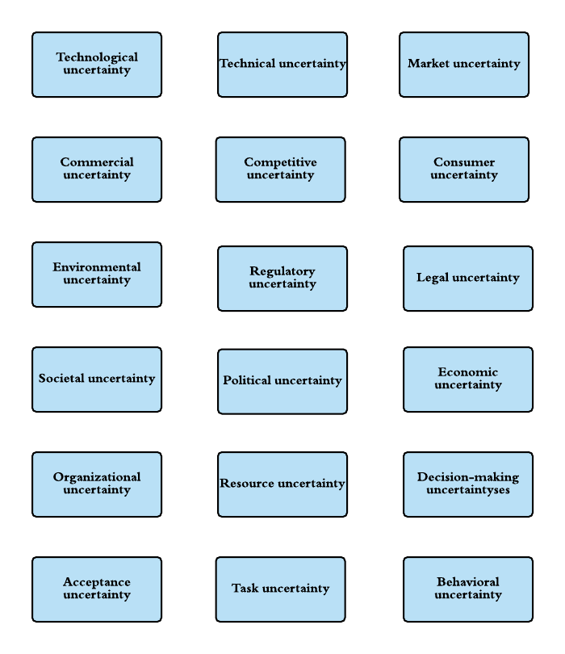
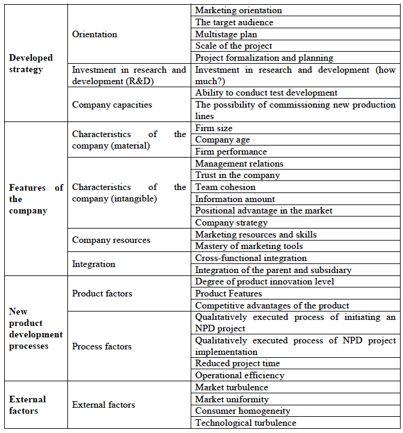
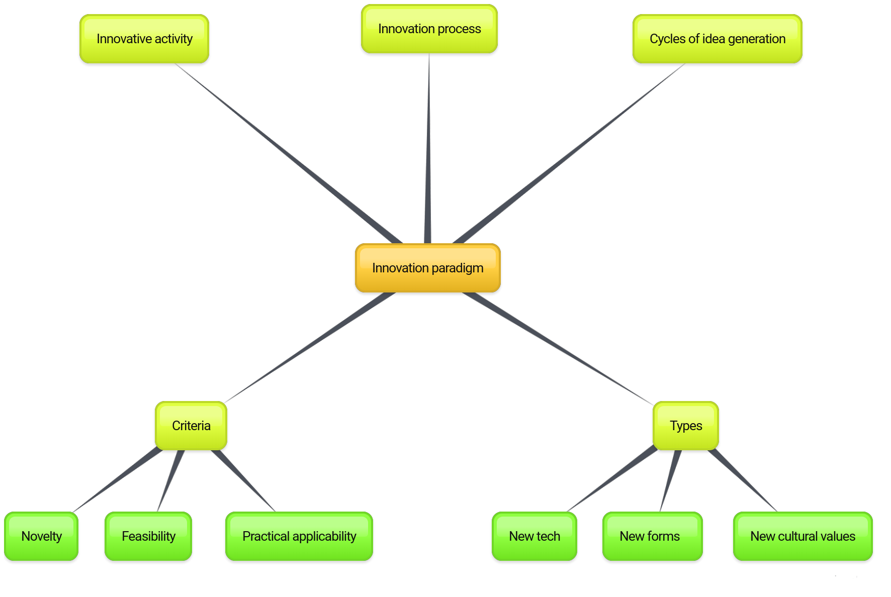
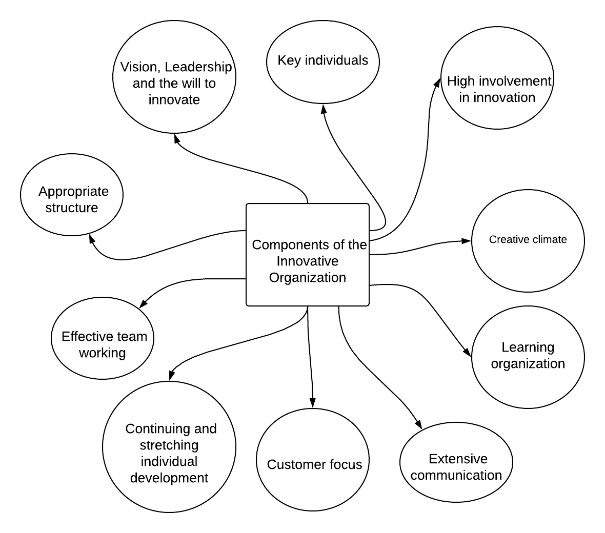
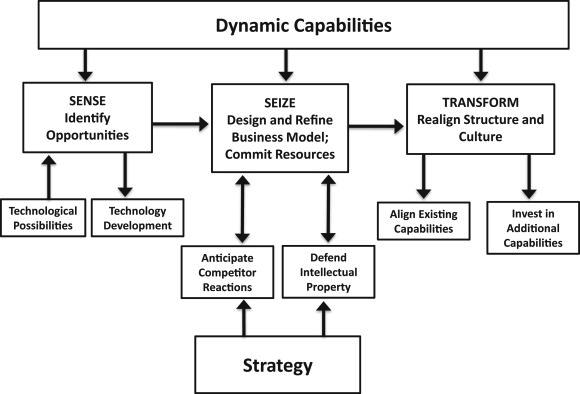

# Technology Assessment and Theoretical framework

## Innovation concept

There are various of rick and uncertainties that can be faced in innovative organization. Innovation is associated with the uncertainty of the economic situation arising from the volatility of supply and demand for goods, money, factors of production, from the multivariance of areas of capital investment and the diversity of criteria for the preference of investing, from limited knowledge about business and commerce and many other circumstances. In my opinion, uncertainty in innovation and innovation risks refers to the likelihood of losses arising when an entrepreneurial firm invests in the production of new goods or servants, in the development of new equipment and technologies that may not find the expected demand in the market, and also when investing in the development of managerial innovations that are not will bring the expected effect. The eight major factor shown in the Figure \@ref(fig:innovationpractices., formulated on reviewed literature.

```{r innovationpractices, echo=FALSE, fig.pos= "h", out.extra = '', out.width='80%', fig.align = "center", fig.cap='Various authorities of uncertainty in innovation practices. Adopted from Jalonen (2011)'}

```

For the NPD success factors there is a table summarizing each of the notions in for of the table for the common success factors must-know objectives (as shown in Table 1.). One of the most important factor, that most authors point out about cross-functional integration and this factor correlates with the installation about the nature of the NPD project - its implementation affects several functional processes of the company, including marketing, research and development, production, etc. [@schimmoellerSUCCESSFACTORSNEW2010].

The proposed grouping divides the totality of NPD project success factors into 4 groups:
* Developed strategy
* Features of the company
* New product development processes
* External factors

Basically, diffusion of managerial innovation is the transfer of managerial technology and organizational innovation showed in Figure \@ref(fig:seven).

```{r seven, echo=FALSE, fig.pos= "h", out.extra = '', out.width='70%', fig.align = "center", fig.cap='Self-made table based on article of the Lee Schimmoeller, combined with additional thoughts (2010)'}
library(knitr)

```

## Innovation outputs

At first, it is essential to have a full description of 4P’s innovation theoretical concept. The original notion of the “innovation” itself  the term of “innovations” were first used at the beginning of the 20th century by the well-known economist Joseph Schumpeter as specific term in order to designate and use new types of consumer goods, new production and vehicles, markets and forms of organization in industry working on new principles [@sledzikSchumpeterViewInnovation2013]. Beforehand, it is vital to cover four major topics such as definitions of innovation, creating and capturing value from innovation, innovation, and performance and models of innovation. Considering different characteristics of each of those, 4P’s model consists of directions of change: product innovation, process innovation, position innovation and paradigm innovation respectively and within this framework, innovation can be described as “radical” and “incremental” depending on the components and architecture. Without revising old models and trying to analyze new concepts, effective management and understanding are impossible. Organizational structure notion itself, innovation-oriented business culture and competencies are vital aspects which lead innovative enchacment [@bessantManagingInnovation2013]. So, such narrative has core value for innovation theory, and it is precisely described in the paper of @francisTargetingInnovationImplications2005.
Figure \@ref(fig:mindmap) is representing Innovation paradigm schematic mind map.

```{r mindmap, echo=FALSE, fig.pos= "h", out.extra = '', out.width='80%', fig.align = "center", fig.cap='Innovation paradigm schematic mind map'}

```

## Key components of the innovative organization

From the standpoint of the organization, the following are traditionally considered as the main elements of innovation activity, such as defining management objectives, strategy development, analysis and evaluation of particular management effectiveness (KPIs), adjustment of innovation processes, organization of monitoring the implementation of the program of innovation activities, additional coordination of the program implementation, definitions of control technologies, management program development.

Innovation process proposes to understand a consistent chain of events in which innovations mature from the idea to a specific product, technology or service and are considered in economic practice. Most of them described in research conducted by Joe Tidd and related to the leadership capabilities and building innovation culture among employees as well as needs of further characterisations and higher complexity in technological, market and organisational contingencies and  internal assets R&D activities [@tiddComplexityNetworksLearning1997]. Figure \@ref(fig:components) showing . Some research is devoted to [@matthewsKnowledgeManagementInnovation2003].

Followed by the concept of “high-involvement innovation” (HII), we can differentiate between different stages of evolution of development and characteristics related to them (five-stages model). Generally, it relies upon the field of the continuous improvement (CI) through mobilising a high level of involvement of the workforce in sustained incremental innovation, and some of their effects [@bessantHighInvolvementInnovationContinuous1997]. Thus, this might result in increased performance of an organization through the implementation of “high-involvement innovation” and amenable atmosphere for people to change. There is also a correlation between HII and HR performances, based on the promotion of employee involvement in the industry [@bondarevHighInvolvementInnovation2017].

Finally, the “SPOT” framework stands as shift model from traditional strategy to the strategic innovation approach. Three of the letters describe different processes: P – Innovation Processes, O – Organization for
4 innovation, T – Tools & Technologies to support innovation (abbreviation). Essential “must-know” was about innovation culture and creative climate (analyze of the innovative organisation should take in account disciplines and normative/descriptive approaches). For the fleet services management, utalization of innovational approaches could be seen in the data transfer in product manufacturing installation base.

```{r components, echo=FALSE, fig.pos= "h", out.extra = '', out.width='80%', fig.align = "center", fig.cap='Components of the innovative organization'}

```

## Development of innovation strategy

Case studies have been long established in innovation strategy to present a detailed analysis of the capabilities approach. Meanwhile, the was a representation of the key factors in innovation strategy structuring and several cognitive limits affecting movement to a distinct path. However, we have to mention about Dynamic capabilities, so it may be considered as the company’s ability to undertake volatile environment’s changes and productively use existing resources for creating new configurations of routines and resources. Though the concept of dynamic capabilities is comprehensive enough the core definitions of current concept point to the various organizational processes, such as integration, learning, modification, and others. The paper [34, C. 92] provides a classification of innovative strategies, presented in Figure 1.16, in which strategies focused on active innovative activity are combined into a group of technological ones. At the same time, the creation of fundamentally new technologies involves only a leadership strategy and, to a somewhat lesser extent, a strategy for following the leader, implying a thorough study and fundamental improvement of products created by competitors. The remaining strategies (imitations, copying, dependencies and improvements) are not focused on the full use of the company's own innovative and technological potential. All these strategies can allow the company to compete effectively in certain markets and get a satisfactory financial result, but most of them are not able to ensure the company's competitiveness in the long run

```{r echo=FALSE, fig.pos= "h", out.extra = '', out.width='80%', fig.align = "center", fig.cap='Dynamic capabilities as refinery for business model. Source from Treece (2018)'}
library(knitr)

```

## Literature review on creativity principles

At the moment there are many tools for generating ideas based primarily on the development of creative thinking and team searching for a concrete solution, which usually coming along with usage of heuristic methods to quicklycer “work out” and select many options for the subsequent creation of a product or the solution of problems. However, most scholars do not have equal concensus on management application, generating ideas and ideation that would foster innovative potential and affected productivity and capacity within firms' boundaries in certain way [@dorowGenerationIdeasIdeation2015]. 

The terminology related to ideas generation is described in details in the works of A.Kraslawski, namely, the application of the TRIZ methodology in engineering tasks and product development task segmentation tequinieqs, such as morphological analysis, analogy methods, synectics, brainstorming and lateral thinking [@srinivasanApplicationTRIZCreativity2006]. Although these tools and methods have temporary advantages and make it possible to evaluate the problem from various angles, the experience of the team members serves as the basis for their implementation and should be considered within whole problem structure and. Explicitly, the patent research and patent analysis belong to group of search tools, gaining valuable insights throught new solutions, which is the key to the success of any ongoing project, especially in fleet management, where recent technologies play huge role in gaining advantage on the market. Systematic creativity and innentive principles posses great amount of impact to the scientific, engineering and business tasks and various applications [@mannEvolvingWorldSystematic].

Analysis of patent information is also considered a tool for finding innovative solutuions, while the inventors often underestimate as valuable tool. This trend, to a greater extent, is a consequence of the fact that when conducting patent research, many experts use a limited set of tools to find a new solution. 

In particular, the most common tool for such purposes is the construction of the semantic and topological patent graphs matrix and mapping patent classification, which, of course, makes it possible to visualize all the main technical directions of the research object development in a visual and compact form, but mainly aims at systematization of relevant information [@yanMeasuringTechnologicalDistance, @officeCooperativePatentClassification]. Therefore, it does not allow to fully disclose the application potential of patent information for inventors.

# The technology life cycle and major concepts

### S-curves as models of innovation

Applying mathematical princepls within managerial framework gives abbility to predict flow of innovation life cycle and form an accurate innovation model. Hence, over time the performance of any system andthe value of its main production function naturally changes. Dynamics of a certain evolving indicator goes through several stages in its development. These changes are described by an empirical dependence, having the form of a stylized S-shaped curve. These changes are described by an empirical dependence, having the form of a stylized S-shaped curve. By using the S-shaped curve we can visualize the processes of transition of a socio-economic system from one stable state to another, processes of radical changes accompanying its innovative activity as well as processes of growth and development during crisis stage and other phenomenas. The practical application of the logistic S-shaped curve in the study of innovation was investigated by @fosterWorkingSCurveAssessing1986. The concept of technology S-curves suggests that the amount of improvement in the characteristics of a product or technology over a given period of time or due to a given volume of intellectual costs changes as it grows older/mature. In the early stages of development, product quality improves relatively slowly. With the development of technology, the pace of technological improvement is growing. However, at the stages of maturity, the technology will asymptotically approach the natural or physical limit and for further improvements more and more intellectual and time costs will be needed. The essence of strategic technology management is to determine when the inflection point on the S-curve of technology has already been passed, and then identify and develop next-generation technologies that ultimately change the current one. Thus, the most important thing is to change the technology in time at the intersection point of the S-curves of the old and new technologies. According to the definition given in @kasztlerPracticesFutureRequirements2012, at the emergence stage, a new technology has practically no competitive influence and is poorly integrated into products or processes. During the period of “growth”, the pace of technology diffusion accelerates, its competitiveness increases, while its integration into new products or processes is still small. Having reached "maturity", a number of common technologies acquire the status of key ones and integrate into products or processes, consolidating their high competitive potential. With the loss of competitive influence, the technology becomes basic, enters the saturation stage and can be replaced by new technology. As can be seen from Figure \@ref(fig:scurve), the most critical factors are Technology Limit and Change in Productivity Ratio. A change in productivity coefficient is defined as a turning point due to the emergence of a new opportunity. Another factor is the technological limit. This is manifested when the technology, having exhausted the potential for improvement, reaches maturity. It is at this level that process innovations often take place.

```{r scurve, echo=FALSE, fig.pos= "h", out.extra = '', out.width='80%', fig.align = "center", fig.cap='The S-curve concept of technology life cycle'}
library(knitr)
knitr::include_graphics('figure/S_curve.pdf')
```

S-curves are formed using a regression model that describes the non-linear relationship between the dependent variable (prediction object) and time. The most commonly used equation presented in @sepulvedaPatentApplicationsSource2014 and outlined the relationship between invested in R&D activities. 

\begin{equation} 
  Y_{t}=\frac{L}{1+a\cdot e^{-b\cdot t} }
\end{equation} 

where parameter "a" determines the position of the curve along the time axis, parameter "b" characterizes the steepness of the middle part of the curve (both responsible for location and curve shape). "L" characterizes the upper limit of growth (
asymptotic maximum of the function Y~2~). Currently, quite a lot of materials have been published in which the analysis of the S-curve is presented as a tool for describing and predicting the system development.


### Patent analysis

<!-- https://e-koncept.ru/2015/65139.htm  Видится бходимым перейти к рассмотрению стратегического обоснования патентного метода и его применения. Григорян М. Р. Патентный анализ: стратегическое обоснование, применение, преимущества и ограничения // Научно-методический электронный журнал «Концепт». – 2015. – Т. 30. – С. 341–345. – URL: http://e-koncept.ru/2015/65139.htm.-->

From the standpoint of modern strategic mangament approaches, it is necessary to go on to consider the strategic justification of the patent method and directions of possible application areas. Despite the fact that technology is becoming the main competitive advantage in many markets, a number of managers and decision-makers still have insufficient information about the possible effects of technological changes on the competitiveness of their organization. Providing such missing information is the main function of patent analysis, the value of which lies in the ability to provide most of this information using bibliometric methods. Patent analysis uses bibliometry to analyze the set of data found in patent databases in order to identify leading indicators of technological change. The number of times that a patent is cited provides strategic information on which technologies reach critical mass. In addition, such an analysis determines which competitors and industries actively follow these technologies [WIPO].


<!-- -->


